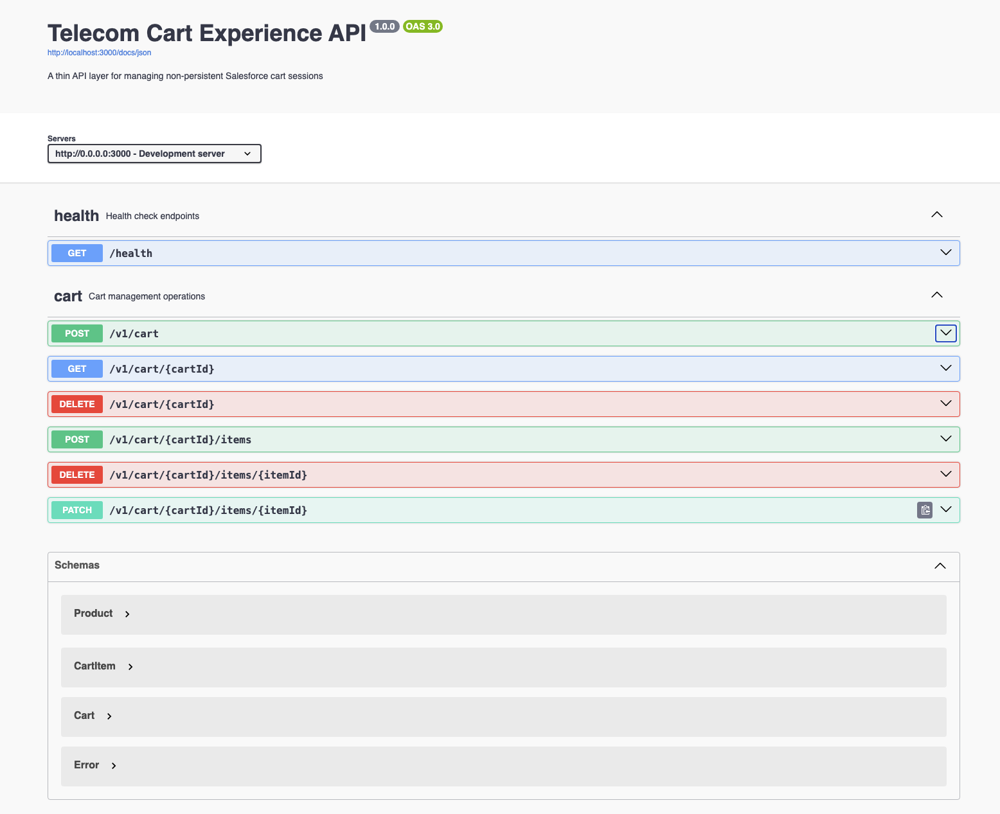
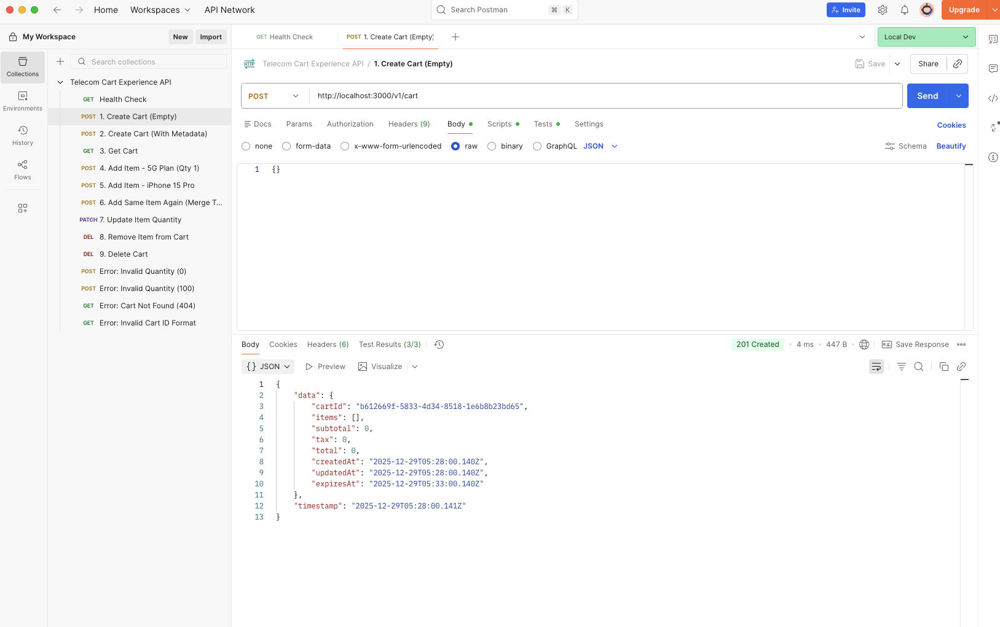

# Telecom Cart Experience API

A REST API for managing shopping cart sessions in a telecom context. Built with Node.js, TypeScript, and Fastify.

## Overview

This API provides cart management capabilities for telecom products including plans, devices, add-ons, and accessories. Carts have a 5-minute session expiration and use in-memory storage to simulate a non-persistent Salesforce context.

Key features:
- Cart session management with automatic expiration
- Product catalog support (plans, devices, add-ons, accessories)
- Quantity management with validation
- Tax calculation (9% standard rate)
- RESTful endpoints with proper HTTP status codes

---

## Getting Started

### Prerequisites

- Node.js 20 or higher
- npm or yarn

### Installation

```bash
npm install
```

### Running the Application

Development mode:
```bash
npm run dev
```

Production build:
```bash
npm run build
npm start
```

The server will start on `http://localhost:3000`

### Documentation

- Interactive API documentation: http://localhost:3000/docs
- Health check endpoint: http://localhost:3000/health
- Architecture details: `SPEC-A-architecture.md`
- API reference: `SPEC-B-api.md`

---

## API Usage

### Using Postman

Import the provided collection `Telecom-Cart-API.postman_collection.json`:

1. Open Postman
2. Click Import and select the JSON file
3. The collection includes all endpoints with example requests
4. Variables like `cartId` and `itemId` are automatically extracted

### Using cURL

Create a cart:
```bash
curl -X POST http://localhost:3000/v1/cart \
  -H "Content-Type: application/json" \
  -d '{"metadata": {"channel": "web"}}'
```

Add an item:
```bash
curl -X POST http://localhost:3000/v1/cart/{cartId}/items \
  -H "Content-Type: application/json" \
  -d '{
    "product": {
      "productId": "plan-5g",
      "name": "5G Unlimited Plan",
      "price": 75.00,
      "category": "plan"
    },
    "quantity": 1
  }'
```

Retrieve cart:
```bash
curl http://localhost:3000/v1/cart/{cartId}
```

### Using Swagger UI

Navigate to http://localhost:3000/docs for interactive testing.

---

## Screenshots

### Swagger API Documentation



*Interactive API documentation with all endpoints*

### Postman Collection



*Complete API testing collection with automated variable extraction*

---

## API Endpoints

| Method | Path | Description |
|--------|------|-------------|
| POST | `/v1/cart` | Create a new cart session |
| GET | `/v1/cart/:cartId` | Retrieve cart details |
| POST | `/v1/cart/:cartId/items` | Add item to cart |
| DELETE | `/v1/cart/:cartId/items/:itemId` | Remove item from cart |
| PATCH | `/v1/cart/:cartId/items/:itemId` | Update item quantity |
| DELETE | `/v1/cart/:cartId` | Delete cart session |

### HTTP Status Codes

| Code | Description |
|------|-------------|
| 200 | Success |
| 201 | Resource created |
| 204 | Success with no content |
| 400 | Invalid request data |
| 404 | Resource not found |
| 410 | Cart session expired |
| 500 | Internal server error |

Note: HTTP 410 (Gone) is used for expired cart sessions to distinguish from resources that never existed (404).

---

## Project Structure

```
src/
  domain/
    services/
      CartService.ts              # Core business logic
    strategies/
      IPricingStrategy.ts         # Pricing calculation interface
    models.ts                     # Domain models
    errors/                       # Custom error definitions
  
  infrastructure/
    clients/
      ISalesforceCartClient.ts              # Storage interface
      SalesforceCartClientMock.ts           # In-memory implementation
  
  index.ts                        # Application entry point

tests/
  CartService.test.ts             # Service layer tests
  PricingStrategy.test.ts         # Pricing logic tests
  SalesforceCartClientMock.test.ts  # Storage layer tests
```

---

## Architecture

The application follows Hexagonal Architecture principles, separating business logic from external concerns.

### Layers

**Domain Layer** (`src/domain/`)  
Contains business logic independent of external systems. Includes cart operations, pricing strategies, and domain models.

**Infrastructure Layer** (`src/infrastructure/`)  
Handles external integrations. The `ISalesforceCartClient` interface defines storage operations, with `SalesforceCartClientMock` providing an in-memory implementation.

**API Layer** (`src/index.ts`)  
Exposes HTTP endpoints using Fastify. Handles request validation, routing, and error mapping.

### Dependency Injection

Services receive dependencies through constructor injection:

```typescript
const cartClient = new SalesforceCartClientMock(5);
const pricingStrategy = new StandardPricingStrategy();
const cartService = new CartService(cartClient, pricingStrategy, config);
```

This enables testing with mock implementations and allows swapping components without modifying business logic.

### Pricing Strategy

Tax calculation implements the Strategy pattern via the `IPricingStrategy` interface. The current implementation applies a flat 9% tax rate. Alternative strategies can be implemented for different pricing models without changing the cart service.

---

## Testing

Run the test suite:
```bash
npm test
```

Run tests in watch mode:
```bash
npm run test:watch
```

Generate coverage report:
```bash
npm run test:coverage
```

### Test Coverage

- **CartService.test.ts**: 25 tests covering cart operations, validation, and expiration
- **PricingStrategy.test.ts**: 5 tests for tax calculations
- **SalesforceCartClientMock.test.ts**: 15 tests for storage and TTL behavior

Total: 45 tests

---

## Configuration

Configuration is managed through environment variables. See `.env.example` for available options.

Example `.env` file:
```bash
# Server configuration
PORT=3000
HOST=0.0.0.0

# Cart settings
CART_TTL_MINUTES=5
MAX_QUANTITY=99
MIN_QUANTITY=1

# CORS
CORS_ORIGIN=*

# API documentation
API_TITLE=Telecom Cart Experience API
API_VERSION=1.0.0
```

Default values are provided for all settings.

---

## Development

### Available Commands

```bash
npm run dev          # Start development server with hot reload
npm run build        # Compile TypeScript to JavaScript
npm start            # Run compiled application
npm test             # Run test suite
npm run test:watch   # Run tests in watch mode
npm run test:coverage  # Generate coverage report
npm run lint         # Run ESLint
npm run format       # Format code with Prettier
npm run type-check   # Check TypeScript types
```

### Code Quality Tools

- TypeScript with strict mode enabled
- ESLint for code linting
- Prettier for code formatting
- Vitest for unit testing

---

## Implementation Details

### Session Management

Cart sessions expire after 5 minutes. A background cleanup process runs every minute to remove expired sessions from memory. Operations on expired carts return HTTP 410 (Gone).

### Storage

The `SalesforceCartClientMock` class provides in-memory storage using a JavaScript Map. This simulates non-persistent Salesforce cart context. In a production environment, this would be replaced with an actual Salesforce API client or distributed cache like Redis.

### Error Handling

Custom domain errors are defined in `src/domain/errors/`:
- `CartExpiredError` - Maps to HTTP 410
- `ResourceNotFoundError` - Maps to HTTP 404
- `ValidationError` - Maps to HTTP 400
- `ConflictError` - Maps to HTTP 409

The global error handler in `src/index.ts` catches these errors and returns appropriate HTTP responses.

### Item Management

When adding a product that already exists in the cart, the quantities are merged automatically. Total quantity per item is limited to 99 units.

---

## Technical Stack

- **Runtime**: Node.js 20+
- **Language**: TypeScript 5.x
- **HTTP Framework**: Fastify
- **Testing**: Vitest
- **Documentation**: Swagger/OpenAPI

---

## Documentation Files

- `SPEC-A-architecture.md` - Architectural design and patterns
- `SPEC-B-api.md` - Detailed API documentation
- `PROMPTS.md` - Development process and design decisions
- `.env.example` - Environment configuration template
- `Telecom-Cart-API.postman_collection.json` - Postman test collection

---

## Common Issues

**Port already in use:**
```bash
PORT=3001 npm run dev
```

**Tests failing:**
```bash
rm -rf coverage node_modules
npm install
npm test
```

**Session expiring too quickly:**  
Increase `CART_TTL_MINUTES` in `.env` file.

---

## Production Considerations

This implementation focuses on core functionality and architectural patterns. For production deployment, consider adding:

- Authentication and authorization
- Rate limiting
- Persistent storage (Redis, database)
- Comprehensive logging and monitoring
- Request/response validation middleware
- Regional tax calculation services
- Inventory management integration
